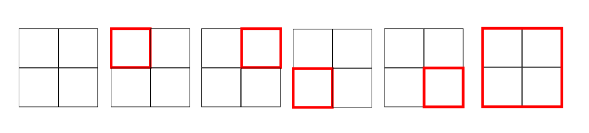

## Task Description

You are asked to provide a solution to the “How many squares?” problem. On an infinite lattice you are given an n x n square, for an arbitrary value of n. How many
squares can you see? For instance: for n = 1 we can see one square, for n = 2 we can see 5 squares, and so on.

## Understanding the problem

When we have $n = 1$, there's only one square:  
$k = 1 \times 1 = 1$


Now let’s look at $n = 2$.  
We calculate $k = 2 \times 2 = 2^2$, which gives 4 small squares.  
But if we observe carefully, there’s also one larger square encompassing them all — making a total of 5 squares:

$$
k = 2^2 + 1 = 5
$$



For $n = 3$, we calculate $k = 3 \times 3 = 3^2 = 9$, but again, there are more squares when we consider all possible combinations:

- $1^2 = 1$ square of size 3×3  
- $2^2 = 4$ squares of size 2×2  
- $3^2 = 9$ squares of size 1×1  

Adding them all:

$$
k = 1^2 + 2^2 + 3^2 = 1 + 4 + 9 = 14
$$

This pattern continues, and we can generalize the total number of squares in an $n \times n$ grid as:

$$
\text{Total squares} = 1^2 + 2^2 + 3^2 + \dots + n^2
$$

Which is described by the formula:

$$
\sum_{k=1}^{n} k^2 = \frac{n(n+1)(2n+1)}{6}
$$


## Compiling and Running the Program

Follow the steps below to compile and run the project on your machine.

### 1. Clone the Repository

Clone the project into a folder of your choice:

```bash
git clone https://github.com/DevCordeiro/how_many_squares.git
cd how_many_squares
```

You should see a structure like this:

``` how-many-squares/
├── CMakeLists.txt
├── include/
│   └── squares.h
├── src/
│   ├── squares.c
│   └── main.c
├── tests/
│   └── test_squares.c
├── bin/               
├── build/
```


### 2. Building the Project

Create a `build/` folder and compile the project using CMake:

``` bash
mkdir -p build
cd build
cmake ..
make
```

### 3. Run the Tests

After building, run the executable:
``` bash
./bin/test_runner
```

The expected console is:
``` ini
[PASS] n = 1 → 1 squares
[PASS] n = 2 → 5 squares
[PASS] n = 3 → 14 squares
[PASS] n = 4 → 30 squares
[PASS] n = 5 → 55 squares
[PASS] n = 10 → 385 squares
```

### 4. Run the Program

After builiding, run the executable:

``` bash
./bin/how_many_squares
```

_(!) Make sure the executable was correctly generated in the bin/ folder. If needed, check your CMakeLists.txt for output path configuration._